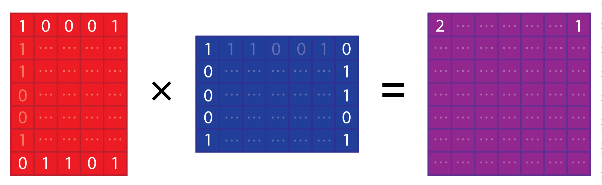

[](https://github.com/mklarqvist/StormBitmaps/releases)
[](LICENSE)

<p align="center"></p>

# Storm bitmaps

These algorithms and bitmaps are used to compute XX<sup>T</sup> for a _binary_ input matrix with dimensions (N,M) using specialized CPU instructions i.e.
[POPCNT](https://en.wikipedia.org/wiki/SSE4#POPCNT_and_LZCNT),
[SSE4.2](https://en.wikipedia.org/wiki/SSE4#SSE4.2),
[AVX2](https://en.wikipedia.org/wiki/Advanced_Vector_Extensions),
[AVX512BW](https://en.wikipedia.org/wiki/Advanced_Vector_Extensions). This is equivalent to computing the all-vs-all set intersection cardinality (|X<sub>i</sub> ∩ X<sup>T</sup><sub>j</sub>|) for pairs of _symmetric_ integer sets. These algorithms are fast in the worst case and _extremely_ fast when the input matrix is sparse.

> **Status (2026-08):** actively developed. The results above supersede the
> 2019 performance figures, which were removed: they were produced with a
> a constant-rate reference counter rather than a cycle counter, on
> hardware no longer available, and described a NEON path the pinned
> `libalgebra` does not contain. See [`PROBLEM_STATEMENT.md`](PROBLEM_STATEMENT.md)
> for the objective, [`RESEARCH_PLAN.md`](RESEARCH_PLAN.md) §16 for the current
> direction, and [`LANDSCAPE.md`](LANDSCAPE.md) §8 for the Phase 0 defects.



Using large registers (AVX-512BW), contiguous and aligned memory, and
cache-aware blocking, we can achieve ~114 GB/s (~0.2 CPU cycles / 64-bit word)
of sustained throughput (~14 billion 64-bit bitmaps / second or up to ~912
billion implicit integers / second) using `STORM_contiguous_t` when the input
data is small (N < 256,000). When input data is large, we can achieve around
0.4-0.6 CPU cycles / 64-bit word using `STORM_t` while using considerably less
memory. Both of these models make use of scalar-bitmap or scalar-scalar
comparisons when the data density is small. Storm selects the optimal memory
alignment and subroutines given the available SIMD instruction at run-time by
using [libalgebra](https://github.com/mklarqvist/libalgebra).

The core algorithms are described in the papers:

* [Faster Population Counts using AVX2 Instructions](https://arxiv.org/abs/1611.07612) by Daniel Lemire, Nathan Kurz
  and Wojciech Muła (23 Nov 2016).
* Efficient Computation of Positional Population Counts Using SIMD Instructions,
  by Marcus D. R. Klarqvist, Wojciech Muła, and Daniel Lemire (upcoming)
* [Consistently faster and smaller compressed bitmaps with Roaring](https://arxiv.org/abs/1603.06549) by D. Lemire, G. Ssi-Yan-Kai,
  and O. Kaser (21 Mar 2016).

## Results

All-pairs set-intersection cardinality over 23 real corpora spanning IR posting
lists, web and social graphs, census and attribute data, sensor logs, and human
and viral genomics — universes from 2.0e5 to 1.3e8, densities from 7.9e-07 to
1.7e-01.

Every configuration is reported. A single number for a single configuration is a
result about the corpora chosen, not about the method.

### 1. Exact cardinality, selection + zone maps (the default)

Per-tile / probe-and-commit selection against a genuine unfiltered all-bitmap
baseline. Exact `|A n B|` for every pair. The last column repeats the whole
measurement with the zone-map filter ablated (`--no-zonemap`), so the filter's
contribution is visible rather than folded in.

| corpus | domain | universe | all-bitmap ns/pair | selected ns/pair | **speedup** | zone map ablated |
|---|---|---:|---:|---:|---:|---:|
| `enwiki-categorylinks` | IR | 129,698,523 | 646,513 | 12.3 | **52,562x** | 56,862x |
| `uscensus2000` | census | 36,974,578 | 128,767 | 5.1 | **25,348x** | 25,499x |
| `dimension_003` | druid | 3,866,847 | 11,640 | 1.7 | **6,887x** | 6,707x |
| `dimension_008` | druid | 3,866,845 | 11,354 | 6.9 | **1,641x** | 1,590x |
| `livejournal-groupmemberships` | graph | 7,489,074 | 23,070 | 15.1 | **1,526x** | 1,646x |
| `dbpedia-link` | graph | 18,268,993 | 65,168 | 55.8 | **1,168x** | 1,150x |
| `wikipedia_link_en` | graph | 11,206,012 | 37,426 | 60.3 | **621x** | 645x |
| `census1881_srt` | census | 4,277,735 | 11,933 | 20.4 | **586x** | 567x |
| `wiki-Talk` | graph | 2,394,385 | 6,859 | 18.6 | **369x** | 379x |
| `com-LiveJournal` | graph | 4,036,538 | 11,925 | 32.4 | **368x** | 351x |
| `dimension_033` | druid | 3,866,847 | 11,431 | 36.8 | **311x** | 319x |
| `census1881` | census | 4,277,806 | 12,367 | 53.1 | **233x** | 242x |
| `as-skitter` | graph | 1,696,415 | 4,713 | 21.4 | **220x** | 260x |
| `gnomad_chr21_exomes_af1e-3` | genomics | 1,461,894 | 4,158 | 20.7 | **200x** | 227x |
| `soc-Pokec` | graph | 1,632,804 | 4,556 | 39.7 | **115x** | 106x |
| `com-Orkut` | graph | 3,072,627 | 9,026 | 96.3 | **94x** | 77x |
| `usher_sarscov2` | genomics | 8,451,771 | 26,826 | 585.7 | **46x** | 49x |
| `wikileaks-noquotes` | text | 1,353,179 | 3,693 | 81.3 | **45x** | 45x |
| `msprime_1M` | genomics-sim | 2,000,000 | 6,076 | 1294.5 | **4.7x** | 4.9x |
| `msprime_100k` | genomics-sim | 200,000 | 451 | 136.2 | **3.3x** | 3.1x |
| `msprime_10k` | genomics-sim | 20,000 | 48 | 22.5 | **2.2x** | 2.2x |
| `weather_sept_85` | sensor | 1,015,367 | 2,755 | 1334.1 | **2.1x** | 1.9x |
| `census-income` | census | 199,523 | 375 | 263.5 | **1.4x** | 1.5x |

### 2. The zone map no longer earns its keep

Ablating it changes nothing: the two speedup columns above agree to within run
noise on all 23 corpora, and where they differ the ablated column is sometimes
*faster* (`as-skitter` 220x -> 260x, `gnomad_chr21` 200x -> 227x).

That is a reversal, and it is a consequence of two of this project's own fixes
rather than a measurement error:

- **C33 gated the zone map's construction.** It is universe-proportional, so a
  row of 102 elements over a universe of 1.3e8 was carrying a 253 kB summary of
  408 bytes of data. It is now built only when `n*512 > m`, which on these
  corpora means most rows do not have one and `bb_occ_sel` falls straight
  through to `bb_dense`.
- **The work the filter used to avoid is now avoided earlier and cheaper.** The
  O(1) span test settles 11-99.5% of pairs before any kernel runs, and
  representation selection routes most of the rest to B x S or B x R, which are
  proportional to the sparse side and never scan `m` in the first place. The
  zone map's job was to stop B x B from ANDing zeros; the selector's job is to
  not run B x B.

So the honest statement is that the zone map was a fix for a cell the selector
now rarely chooses. It is retained, gated, because it still pays on the dense
corpora where B x B is genuinely selected (`weather_sept_85`, `census-income`
route 46% of pairs there) -- and those are exactly the two rows where the
ablated column is worse.

### 3. Thresholded mode (opt-in) — only pairs with Jaccard >= t

Exact cardinalities, restricted to pairs above a caller-supplied similarity
cutoff, via prefix filtering (Bayardo et al. WWW 2007). **Speedup is against the
exact scan, not against all-bitmap**, so it composes with table 1 rather than
replacing it.

Run in **sparse-only mode**: no bitmaps are materialised, so the corpus is bounded
by list size rather than by universe. That is what makes 20,000 rows (200M pairs)
affordable at universe 1.3e8 — and it matters enormously. The same measurement
constrained to the 74 rows a bitmap-bearing harness can hold reported
`enwiki-categorylinks` at **0.99x**; unconstrained it is **323.6x**. A 327x
difference, entirely an artifact of charging an O(N) index build against O(N^2)
pairs that did not exist at that scale.

| corpus | domain | rows | t=0.001 | t=0.01 | t=0.1 |
|---|---|---:|---:|---:|---:|
| `com-LiveJournal` | graph | 20,000 | **414.3x** | **333.6x** | **1,088.6x** |
| `enwiki-categorylinks` | IR | 20,000 | **323.6x** | **417.0x** | **815.5x** |
| `soc-Pokec` | graph | 20,000 | **224.6x** | **246.7x** | **362.5x** |
| `gnomad_chr21_exomes_af1e-3` | genomics | 20,000 | **109.2x** | **114.2x** | **290.9x** |
| `dimension_003` | druid | 15,482 | **128.8x** | **83.1x** | **117.7x** |
| `livejournal-groupmemberships` | graph | 20,000 | **38.6x** | **50.2x** | **123.9x** |
| `as-skitter` | graph | 20,000 | **91.4x** | **81.5x** | **112.8x** |
| `dbpedia-link` | graph | 20,000 | **12.5x** | **12.5x** | **110.2x** |
| `com-Orkut` | graph | 20,000 | **47.8x** | **43.0x** | **107.9x** |
| `wikipedia_link_en` | graph | 20,000 | **6.4x** | **14.4x** | **103.4x** |
| `uscensus2000` | census | 200 | **40.6x** | **15.3x** | **28.9x** |
| `wikileaks-noquotes` | text | 200 | **4.8x** | **3.4x** | **40.1x** |
| `wiki-Talk` | graph | 20,000 | **3.2x** | **4.7x** | **12.7x** |
| `dimension_033` | druid | 173 | **10.9x** | **7.5x** | **10.7x** |
| `census1881` | census | 200 | **4.0x** | **4.8x** | **4.4x** |
| `census1881_srt` | census | 200 | **1.7x** | **1.8x** | **4.0x** |
| `dimension_008` | druid | 5,240 | 1.00x | 1.00x | 1.00x |
| `weather_sept_85` | sensor | 200 | 1.00x | 1.00x | 1.00x |
| `census-income` | census | 200 | 1.00x | 1.00x | 1.00x |
| `usher_sarscov2` | genomics | 7,926 | 1.00x | 1.00x | 1.00x |
| `msprime_1M` | genomics-sim | 917 | 1.00x | 1.00x | 1.00x |

Gated: where prefix filtering would lose, the gate falls back to the exact scan
and the entry reads 1.00x. The corpora that bypass at every threshold —
`msprime_*`, `weather_sept_85`, `census-income`, `dimension_008`,
`usher_sarscov2` — are the dense ones, where at 6-17% density almost every pair
clears any cutoff and there is nothing to skip.

`msprime_100k` and `msprime_10k` are absent: at 7.7-11% density the exact
baseline over 200M pairs did not complete in budget. `msprime_1M` did and gated
to 1.00x, so both are expected to behave identically.

### 4. Storage cost — bits per value, data and metadata separated

Reported the way the Roaring papers do so corpora of different cardinality are
comparable. **Metadata is listed separately and deliberately**: the zone map and
rank index are not part of any representation, they are what the selector needs
in order to choose one, and folding them into the data column would hide the
cost of the mechanism that is new here.

| corpus | universe | bitmap | array | runs | EWAH | **best** |
|---|---:|---:|---:|---:|---:|---:|
| `census-income` | 199,523 | 5.77 | 32.00 | 20.73 | 3.86 | **3.08** |
| `msprime_100k` | 200,000 | 12.57 | 32.00 | 31.88 | 5.29 | **4.44** |
| `weather_sept_85` | 1,015,367 | 15.78 | 32.00 | 30.06 | 7.87 | **6.77** |
| `usher_sarscov2` | 8,451,771 | 1,080.60 | 32.00 | 2.04 | 4.06 | **2.02** |
| `wikileaks-noquotes` | 1,353,179 | 982.89 | 32.00 | 11.36 | 19.46 | **10.64** |
| `census1881` | 4,277,806 | 852.27 | 32.00 | 58.86 | 43.79 | **29.92** |
| `as-skitter` | 1,696,415 | 1.26e5 | 32.00 | 47.13 | 77.72 | **29.26** |
| `wikipedia_link_en` | 11,206,012 | 2.68e5 | 32.00 | 46.21 | 72.90 | **28.27** |
| `dbpedia-link` | 18,268,993 | 6.38e5 | 32.00 | 56.38 | 101.63 | **31.84** |
| `uscensus2000` | 36,974,578 | 1.24e6 | 32.00 | 57.78 | 91.89 | **31.98** |
| `enwiki-categorylinks` | 129,698,523 | 3.33e6 | 32.00 | 62.72 | 113.23 | **31.85** |

On dense corpora the numbers are Roaring-comparable (3–7 bits/value). On sparse
ones the dense bitmap costs 10^3–10^6 bits per value, which is the storage
statement of the same fact the timing tables make: **a bitmap over a large sparse
universe is not a compression scheme, it is a liability.** `usher_sarscov2` is
the standout at 2.02 bits/value — its carriers cluster into long runs.

#### Selector metadata is universe-proportional, and that is a defect

| corpus | universe | meta B/row | data B/row | ratio |
|---|---:|---:|---:|---:|
| `census-income` | 199,523 | 6,335 | 13,344 | 0.5x |
| `weather_sept_85` | 1,015,367 | 32,031 | 54,497 | 0.6x |
| `census1881` | 4,277,806 | 134,784 | 18,774 | 7.2x |
| `as-skitter` | 1,696,415 | 53,479 | 49 | **1,083x** |
| `dbpedia-link` | 18,268,993 | 575,415 | 113 | **5,051x** |
| `enwiki-categorylinks` | 129,698,523 | 4,084,799 | 155 | **26,312x** |

`build_row()` constructs the rank index and zone map unconditionally, and both
scale with **universe**, not cardinality. On `enwiki-categorylinks` that is 4 MB
of selector metadata attached to 155 bytes of data. The complement
representation already carries the right guard — it is built only when
`2n > universe` — and rank and occupancy have none. **This is a known defect, not
a design choice**, and it is why bitmap-bearing measurements are restricted to
tiny row counts on the large-universe corpora. Fixing it is a prerequisite for
the C ABI (`RESEARCH_PLAN.md` §16.3).

### What the tables show

- **Density drives everything.** Below ~1e-5 the speedup is 200-1000x; above
  ~1e-2 it collapses to 1.5-4x. That gradient *is* the contribution.
- **No single representation wins.** On `msprime_1M`, B x S is 843x faster than
  B x B on pairs where `min(|A|,|B|) <= 10` and 18x *slower* where it exceeds
  1e5. Choosing per pair is the whole design.
- **All-bitmap is infeasible, not merely slow, at scale.** At universe 1.3e8 a
  row is 15.8 MB, so a bitmap AND moves 32 MB per pair — 643 microseconds to
  compute an answer that is zero 100% of the time.
- **Selection costs 0.02-0.4% of runtime** (Gate 1 budget: 2%). Per-pair
  selection fails that budget; per-tile and probe-and-commit pass.

## All-pairs: the tile pipeline

Full record: [`results/ALLPAIRS.md`](results/ALLPAIRS.md) · harness:
`bench/bench_tile.cpp`

**In the target regime 95–100% of pairs have an empty intersection**, so the
operation being optimised is disjointness *proof*, not intersection. Exploiting
the all-pairs structure — rather than the per-pair constant — is worth one to
three orders of magnitude:

| corpus | unfiltered B×S | tile pipeline | speedup |
|---|---:|---:|---:|
| dimension_003 | 56.68 ns | **0.010 ns** | ~5,700× |
| soc-Pokec | 55.80 ns | **0.098 ns** | ~570× |
| com-LiveJournal | 42.60 ns | **0.214 ns** | ~200× |
| as-skitter | 42.82 ns | **0.408 ns** | ~105× |
| com-Orkut | 149.13 ns | **2.571 ns** | ~58× |
| dimension_033 | 2522.1 ns | **47.8 ns** | ~53× |
| wiki-Talk | 69.18 ns | **9.762 ns** | ~7× |
| census-income | 2382.8 ns | **323.9 ns** | ~7× |
| weather_sept_85 | 4613.7 ns | **1115.0 ns** | ~4× |

The pipeline gates on measured selectivity, then for tiles it accepts: sorts
rows by minimum, rejects pairs whose extents cannot meet, transposes the tile's
zone maps to resolve every pair's bucket overlap in one sparse pass, and probes
only survivors. Tiles it rejects are routed to the cell the pairing matrix
selects for that density.

**Every improvement across 19 iterations came from removing work; none came from
executing it faster.** Ten iterations produced no improvement and are recorded
with the reasons — including a dual-tree over rows, which prunes 89% of node
pairs at 16 rows/node and **0.0% at 256**, because union filters saturate
quadratically. Read [`results/ALLPAIRS.md`](results/ALLPAIRS.md) §5 and §7 before
quoting any figure above: the transpose build is excluded by an amortisation
argument, only within-tile pairs are measured, and bucket width is still tuned.

## Real-corpus benchmark vs CRoaring

Full record: [`results/CORPORA.md`](results/CORPORA.md) · raw runs:
[`results/corpora/`](results/corpora/) · reproduce: `bench/run_corpora.sh`

Twenty-three real corpora. Twelve are the
[`real-roaring-datasets`](https://github.com/RoaringBitmap/real-roaring-datasets)
files **CRoaring's own benchmark harness runs by default** — so this is the
incumbent's chosen data, not ours — plus five larger modern graphs. CRoaring is
given `roaring_bitmap_run_optimize()` so it gets its run containers, and all
ratios are quoted against that tuned variant. Every kernel is checked against
`roaring_bitmap_and_cardinality` on every pair before anything is timed.

**Online selection beats fixed CRoaring on 22 of 23 corpora.** Reproduce with
`bench/vs_roaring.sh`; raw table in [`results/vs_roaring.csv`](results/vs_roaring.csv).

This is the *dynamic* number — Storm decides per tile, at runtime, from row
metadata. It is not the best fixed cell chosen with hindsight, which is what
this table used to report and which no caller can actually obtain. Roaring is
`run_optimize()`d **plus the C35 array→bitset promotion**, i.e. the tuned
configuration this project's own findings produce, and it is timed in the same
process on the same rows and the same pair set. Both sides get one untimed
warm-up pass and then repeat to a 100 ms floor, minimum taken; the table is the
median of three whole-process runs, with the observed range beside it.

| corpus | domain | universe m | Roaring ns | Storm ns | **vs Roaring** | range | cell mix |
|---|---|---:|---:|---:|---:|---|---|
| enwiki-categorylinks | IR | 129,698,523 | 26.0 | 11.8 | **2.21×** | 2.15–2.49 | B×S=89.1% ∅=10.9% |
| uscensus2000 | census | 36,974,578 | 11.4 | 4.6 | **2.47×** | 2.37–2.76 | B×S=41.1% S×S=4.1% ∅=54.8% |
| dbpedia-link | graph | 18,268,993 | 98.5 | 49.2 | **2.00×** | 1.96–2.02 | B×S=97.3% S×S=1.3% ∅=1.4% |
| wikipedia_link_en | graph | 11,206,012 | 103.3 | 58.8 | **1.75×** | 1.70–1.78 | B×S=96.9% S×S=1.1% ∅=2.0% |
| livejournal-groupmemberships | graph | 7,489,074 | 28.4 | 17.1 | **1.67×** | 1.61–1.69 | B×S=54.9% S×S=23.1% ∅=21.9% |
| com-Orkut | graph | 3,072,627 | 196.6 | 91.2 | **2.14×** | 2.12–2.19 | B×S=99.5% ∅=0.5% |
| com-LiveJournal | graph | 4,036,538 | 48.0 | 31.8 | **1.51×** | 1.46–1.55 | B×S=81.6% S×S=3.6% ∅=14.8% |
| soc-Pokec | graph | 1,632,804 | 92.9 | 37.7 | **2.47×** | 2.46–2.48 | B×S=90.6% S×S=4.9% ∅=4.5% |
| as-skitter | graph | 1,696,415 | 25.7 | 20.8 | **1.24×** | 1.17–1.25 | B×S=73.9% S×S=8.9% ∅=17.2% |
| wiki-Talk | graph | 2,394,385 | 37.3 | 13.9 | **2.77×** | 2.69–2.79 | B×S=69.1% S×S=16.5% ∅=14.4% |
| dimension_003 | druid | 3,866,847 | 2.9 | 1.6 | **1.83×** | 1.75–1.83 | B×S=0.1% B×R=0.3% ∅=99.5% |
| dimension_008 | druid | 3,866,845 | 7.3 | 6.2 | **1.17×** | 1.15–1.31 | B×S=53.4% B×R=25.0% S×S=7.1% ∅=14.6% |
| dimension_033 | druid | 3,866,847 | 92.0 | 28.3 | **3.25×** | 3.21–3.48 | B×R=72.0% ∅=28.0% |
| census1881 | census | 4,277,806 | 48.1 | 53.1 | *0.91×* | 0.80–0.92 | B×B=0.1% B×S=31.7% S×S=4.8% ∅=63.3% |
| census1881_srt | census | 4,277,735 | 58.8 | 15.5 | **3.73×** | 3.49–3.80 | B×B=0.0% B×S=35.7% B×R=11.8% S×S=15.8% ∅=36.6% |
| wikileaks-noquotes | text | 1,353,179 | 368.0 | 66.9 | **5.49×** | 5.00–5.81 | B×B=0.1% B×S=24.7% B×R=39.0% ∅=36.1% |
| weather_sept_85 | sensor | 1,015,367 | 1260.3 | 1124.9 | **1.13×** | 1.02–1.19 | B×B=45.9% B×S=53.4% ∅=0.6% |
| census-income | census | 199,523 | 428.5 | 249.5 | **1.72×** | 1.62–1.73 | B×B=46.1% B×S=53.8% ∅=0.1% |
| usher_sarscov2 | genomics | 8,451,771 | 953.7 | 491.5 | **1.94×** | 1.80–2.78 | B×S=85.5% B×R=14.0% ∅=0.5% |
| gnomad_chr21_exomes_af1e-3 | genomics | 1,461,894 | 62.0 | 20.2 | **3.09×** | 2.99–3.32 | B×S=70.2% S×S=12.3% ∅=17.4% |
| msprime_1M | genomics-sim | 2,000,000 | 1764.3 | 1114.0 | **1.58×** | 1.21–1.79 | B×B=14.0% B×S=83.7% S×S=0.4% ∅=1.9% |
| msprime_100k | genomics-sim | 200,000 | 238.4 | 134.2 | **1.85×** | 1.52–2.00 | B×B=14.0% B×S=83.7% S×S=0.4% ∅=1.9% |
| msprime_10k | genomics-sim | 20,000 | 88.2 | 21.7 | **4.03×** | 3.52–4.09 | B×B=25.0% B×S=72.4% S×S=0.3% ∅=2.4% |

∅ = pairs settled as provably disjoint by the O(1) span test, no kernel run.

**The cell mix is the actual result.** No single pairing is right everywhere:
B×S carries the sparse graph corpora, B×R the run-structured Druid and text
ones, B×B still takes 46% of the dense sensor and census pairs, and on
`dimension_003` 99.5% of pairs never reach a kernel at all. A library that
picked any one of these would lose on the corpora the others own.

**The one loss is honest.** `census1881`'s per-pair oracle measures 45.1 ns against Roaring's 48.9, so
winning decisions exist and one-cell-per-tile cannot express them.
`Policy::Refine` (rank candidates once per tile, choose between the top two per
pair) recovers them: 0.92× → **1.09×**, with the cell mix moving to within a
point of the oracle's at 0.17% selection cost.

It is off by default because it is a net loss elsewhere. Swept over 14 corpora
(`bench/refine_gate.sh`), never-refine is best or tied on 10 of 14 —
`dimension_008` 1.08× → 0.70×, `dimension_033` 3.15× → 1.81×, `soc-Pokec`
2.29× → 1.90×. The two corpora it wins are the two with the highest per-pair
cost, where 2 ns of extra decision is free, but gating on predicted per-pair
cost also catches `wikileaks` and `usher_sarscov2`, where it loses. The benefit
does not track any O(1) signal available at tile time.

So `census1881` and `dimension_008` want opposite settings of the same knob, and
no data-independent rule yet separates them. Both are reported at the default.

### Why Storm also wins on the *dense* corpora

At 6–17% density both sides should be doing near-identical popcount work. They
are not. A container census via `roaring_bitmap_statistics()` after
`run_optimize()`:

| corpus | array | bitset | run | global density |
|---|---:|---:|---:|---:|
| weather_sept_85 | **2,274** | 561 | 21 | 6.3e-02 |
| census-income | **553** | 180 | 35 | 1.7e-01 |
| census1881 | **1,332** | 0 | 132 | 1.2e-03 |
| uscensus2000 | **2,219** | 0 | 2 | 8.1e-07 |

Roaring picks its container by testing **per-2¹⁶-chunk cardinality against a
fixed threshold of 4096**. With a large universe the set mass spreads thinly
enough that chunks stay under that threshold even when *global* density is 6% or
17%, so CRoaring runs array merges where Storm popcounts. census1881 has **zero**
bitset containers at density 1.2e-3. This is a "do the right kind of work"
result, not a SIMD result.

### Ablation: does the zone map earn its keep?

The zone map (1 bit per 512-bit bin) is built unconditionally by `build_row()`,
so the table above cannot answer this — it only ever shows the planned kernel.
`bench_baseline` therefore also times each cell's best **index-free** variant
against its index-using one. Full table:
[`results/corpora/ABLATION.md`](results/corpora/ABLATION.md).

**Net: helps 12/17, neutral 5/17, hurts 0/17, at 0.195% of bitmap bytes.**

| | |
|---|---|
| net gain, best-cell level | 1.00×–3.80× |
| B×B in isolation | up to 745× — but mostly on corpora where B×B loses anyway |
| B×S in isolation | **below 1.0× on 10 of 17** — gating bins costs more than the probes it saves |
| largest gains | both ends of the density range; middle mostly neutral |
| `_srt` vs unsorted | sorted variants gain more (3.80 vs 2.49, 3.48 vs 2.21) — clustering is what empties bins |

Two things follow. The five neutral corpora are exactly those where a sparse
cell (B×S, S×S, R×R) wins and reads no side structure — the zone map is built,
unused, and paid for only in space. And it never loses at system level *because*
selection routes around it: per-cell it can lose badly (B×S with zone map on
census1881 is 0.25×). The zone map is not independently a good idea; it is a
good idea **given** a selector that can decline it.

### Measurement caveats — read before quoting any number above

1. **Ratios are reliable to about ±1 significant figure, no better.** The full
   sweep was run twice: both runs win 17/17, but ratios drift by a median of
   1.15× and up to 1.65×, and **the winning cell changes on 5 of 17**. Three of
   those five are harmless near-ties (census1881 run 1: B×B 15.81 vs B×S 15.83);
   `uscensus2000` and `dimension_033` are not, moving both winner and magnitude,
   and should not be quoted until the harness is fixed. Repeating single corpora
   as independent processes gives spreads of 16.1–18.2× (census1881) and
   **1.2–3.7× (dimension_003)** — the fastest corpora are the noisiest, since at
   2.9 ns/pair a 20,000-pair batch lasts only 58 µs.
2. **The table is systematically pessimistic.** Values were collected in one
   back-to-back batch of 17 corpora; standalone repeats land at or *above* the
   recorded figure in every case checked. Likely thermal accumulation and
   cross-corpus cache pollution.
3. **One microarchitecture** (Apple M4). Zone-map growth is known ARM-only and
   flat on Sapphire Rapids, so x86 numbers will differ and must be measured.
4. **Selection cost is excluded** — cells are timed directly. The near-free
   selection claim is measured separately.
5. **`vs all-bitmap` is a weak baseline** at large universe (104 MB for
   census1881 at 200 rows). The CRoaring column is the defensible one.

The fix for (1) and (2) is interleaved round-robin timing across corpora plus
median-and-IQR over N independent runs, which is what `bench_cells` already does
per-variant. Until that lands, treat the ordering as sound and the exact ratios
as provisional.

## API

The interface is found in the file `storm.h`.

```c
#include "storm.h"

int intcmp(const void* aa, const void* bb) {
    const uint32_t* a = aa, *b = bb;
    return (*a < *b) ? 0 : (*a > *b);
}

int main() {
    uint32_t n_vectors = 10000; // number of rows
    uint32_t n_width = 1000; // number of columns
    uint32_t n_bits_set = 128; // number of bits set per row

    STORM_t* storm = STORM_new(); // STORM model
    STORM_contiguous_t* storm_cont = STORM_contig_new(n_width); // STORM contiguous memory
    uint32_t* vals = malloc(n_bits_set*sizeof(uint32_t)); // array for random values

    // Foreach vector (row)
    for (int i = 0; i < n_vectors; ++i) {
        // Generate random bits for each row
        for (int j = 0; j < n_bits_set; ++j) {
            vals[j] = rand() % n_width; // draw random number
        }
        // Input data must be sorted.
        qsort(vals, n_bits_set, sizeof(uint32_t), intcmp);
        
        // Add data to either model.
        STORM_add(storm, &vals[0], n_bits_set);
        STORM_contig_add(storm_cont, &vals[0], n_bits_set);
    }

    uint64_t cstorm      = STORM_pairw_intersect_cardinality(storm);
    uint64_t cstorm_cont = STORM_contig_pairw_intersect_cardinality(storm_cont);

    printf("contig=%llu storm=%llu\n",cstorm_cont,cstorm);

    free(vals);
    STORM_free(storm);
    STORM_contig_free(storm_cont);
    return 1;
}
```

## Compilation

StormBitmaps can be compiled using the standard `cmake` workflow:
```bash
cmake .
make
```

As with all `cmake` projects, you can specify the compilers you wish to use by
adding (for example) `-DCMAKE_C_COMPILER=gcc -DCMAKE_CXX_COMPILER=g++` to the
`cmake` command line. We tell the compiler to target the architecture of the
build machine by using the `-march=native` flag. This can be disabled by passing
the `-DSTORM_DISABLE_NATIVE=ON` argument to `cmake`.

On Linux and MacOSX, and when running with the native compilation flag, we do
not need to specify the target hardware instructions set. This is not the case
on Windows where we need to set these flags:

| `CMake` Flag               | Description                |
|--------------------------|----------------------------|
| `STORM_ENABLE_SIMD_AVX512` | Enable AVX512 instructions |
| `STORM_ENABLE_SIMD_AVX2` | Enable AVX256 instructions |
| `STORM_ENABLE_SIMD_SSE4_2` | Enable SSE4.2 instructions |

For example, we can run `cmake -DSTORM_ENABLE_SIMD_SSE4_2="ON" .` to enable SSE4.2 instructions.

and run `./benchmark`.
